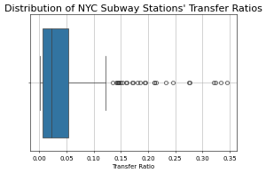
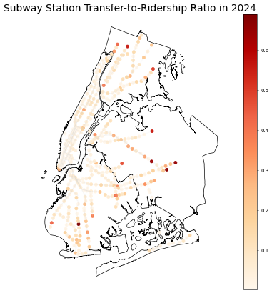
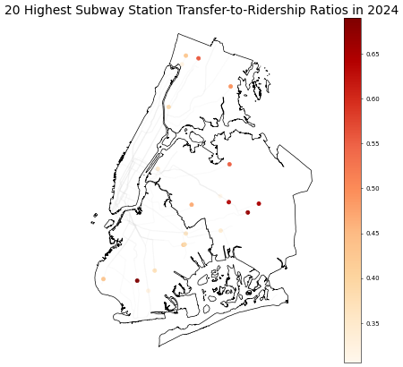
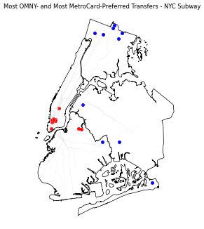
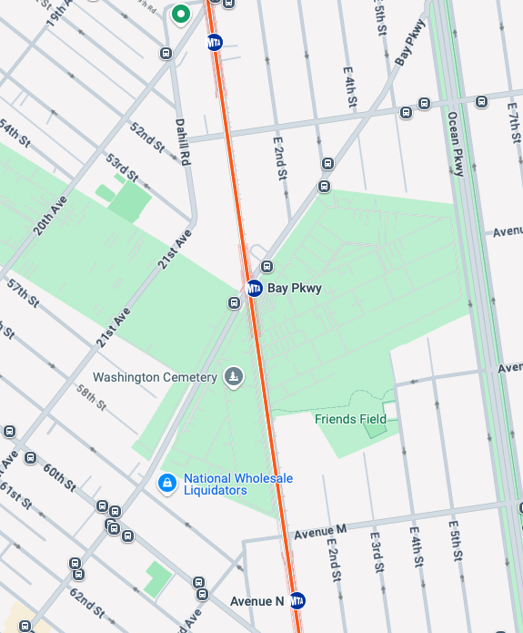

# NYC Subway Transfers

## Introduction
Multi-modal transportation is one of the key ways to make transportation work for everyone. Not every mode of transportation is warranted in all areas so operating the right one for a corridor is vital to a well functioning system. In New York City, urban rail and buses integrate seamlessly using the OMNY and Metrocard payment systems. They help integrate the confusing, multi-agency web of transportation services provided in the region (the full list of fare integrated connections can be seen [here](https://en.wikipedia.org/wiki/New_York_City_transit_fares#Current_fares)). Using the [hourly subway ridership dataset](https://data.ny.gov/Transportation/MTA-Subway-Hourly-Ridership-2020-2024/wujg-7c2s/about_data) one can see both the number of transfers and the number of total riders (including transfers) at each subway station in the MTA. I wondered: **which subway stations are most reliant on transfers**? In other words, which stations have the highest proportion of transfers to riders in the system?  

## Process
To answer this, I grouped all stations into complexes (e.g.: Metropolitan-Lorimer St is composed of both the G and L stations) and summed up their transfer and ridership numbers for 2024. With this data, I divided the number of transfers by the number of riders to find the transfer-to-total-ridership ratio (the higher the number, the more reliant it is on transfers for ridership). 

There are some important caveats to this data:
1. Ridership is defined as the number of riders who *entered* at a subway station -- not the total number of people who *use* this station in general. Therefore, **the ratios are doubled to get a true estimate of the transfer ratio**. In other words, I'm asking *what's the ratio of users who make an out-of-system transfer to or from each subway station?*
2. The transfers here include:
    - bus to subway transfers (MTA Local bus, (most) MTA Express buses, NICE buses, Westchester Bee-Line buses)
    - out-of-network subway transfers (Livonia Ave (L) <> Junius St (3) and Lexington-59th St <> Lexington 63rd St are the only ones in the system)
    - Roosevelt Island Tram to the subway
3. The transfers *not* included are:
    - between subway services in the same complex (e.g.: 1 -> 2/3)
    - the PATH to subway
    - any ferry to the subway (although SIR -> SI ferry -> subway station below Fulton St counts)
    - commuter rail (MNR, LIRR, NJ Transit) to subway
    - local bus to local bus (despite being a free in-system transfer)
 
## Results
The majority of NYC subway stations have a relatively low transfer ratio in the 1%-10% range. There are a few, however, that are much higher -- the highest being 70%! 

The locations of the high and low transfer ratio subway stations are also quite interesting: 

The areas with low ridership ratios are immediately identifiable as the Central Business Districts of NYC. This makes a lot of sense since people who work very close to these high-density districts can walk to the subway. Additionally, since so many subway lines converge in these areas there's little need for a bus to subway transfer and an in-station subway-to-subway transfer is more likely. On the other hand, the high transfer ratio stations need a closer look. To start, let's isolate the 20 highest transfer stations: 

The majority of these stations are at, or near, the terminal of a subway branch. These stations are all bus hubs that bring riders from outside the walkable catchment area to the subway system. The Bronx is a great example where 3 of the 5 terminals are found in the top 20 list. Not only does the NYC bus system serve these stations but the Bee-Line bus system in Westchester does, too. In fact, about a [quarter of all Bee-Line riders](https://tstc.org/wp-content/uploads/2024/07/2024-07-08_Buzz-on-the-Bee-Line-2.0.pdf) ride the bus in order to transfer to the subway. 

Interestingly, the transfers at terminal stations near the Bee-Line and NICE systems can differ by payment system, too: Metrocard is significantly more preferred for transfers at these stations than the average station. The reason should be obvious: in order for a rider to connect to the Bee-Line or NICE systems on the same fare they need to use a Metrocard. The majority of these stations are in the north Bronx but Far Rockaway-Mott Ave is also in the top 10. Moreover, the stations with the most OMNY transfers over Metrocard transfers are all in or near the Manhattan CBD. We should note that these stations all have proportion of transfers, too. The top 10 of both of these categories can be seen below: 

The blue dots show stations where transfers are more likely to use Metrocard than OMNY(this is the minority of stations in the system). The red dots show stations where OMNY is the preferred payment method for transfers. The payment method preferences can differ drastically: the most OMNY preferred transfer station has 17% of transfers using Metrocard while the most Metrocard card preferred station has 98% using Metrocard! 

In general, OMNY is slightly preferred for subway transfers making up 55% of all transfers. On the buses, however, the story flips: metrocard is preferred for transfers making up 52% of all transfers. However, those that do use OMNY on NYC buses are more likely to be transferring than Metrocard riders (15% of Metrocard bus riders are transfers versus 22% of OMNY riders).

To me, the most interesting high-transfer-ratio station involves the dark red dot in Brooklyn: Bay Parkway on the F line. It's a station with a single (albeit quite [popular](https://www.mta.info/document/113336)) bus line: the B6. So what gives? The answer is more obvious when you take a look at what's *not* around the station: 

The catchment area for this station is dominated by cemetaries! Since so few people *live* near the station it follows that the possible number of single-mode riders is also significantly cut back! Additionally, it's less than 1,500 feet to the next station to the north (Avenue I). Therefore, a larger proportion of its potential riders can only conveniently reach it by utilizing a bus connection! Additionally, the B6 is the 4th most used bus in Brooklyn -- even ahead of some SBS services! This service directly connects the F to the Q at Avenue J and the N at Bay Parkway, too, meaning that it's a very useful bus service to many commuters who may even live outside the immediate area.  

## Conclusion
Multi-modal transit is extremely important for a well functioning public transportation system. Relying on multiple modes allows for people to find the system more useful and convenient for their commutes. With the connections between the NYC subway and New York area buses we can see how intertwined the two are. With this analysis, we can get a better understanding of the unique cases where transfers make up the majority of a subway station's ridership. 
