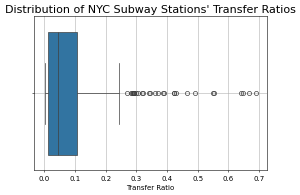

# NYC Subway Transfer Ratios

## Introduction
Multi-modal transportation is one of the key ways to make transportation work for everyone. Not every mode of transportation is warranted in all areas so operating the right one for a corridor is vital to a well functioning system. In NYC, MetroCard and OMNY allow for easy, integrated transfers between modes within the MTA orbit as well as with neighboring bus and rail operators (full list of fare integrated connections [here](https://en.wikipedia.org/wiki/New_York_City_transit_fares#Current_fares)). Using the [hourly subway ridership dataset](https://data.ny.gov/Transportation/MTA-Subway-Hourly-Ridership-2020-2024/wujg-7c2s/about_data) one can see both the number of transfers and the number of total riders (inclusing transfers) at each subway station in the MTA. I wondered: **which stations are most reliant on transfers**? In other words, which stations have the highest proportion of transfers to riders in the system?  

## Process
To answer this, I grouped all stations into complexes (e.g.: Metropolitan-Lorimer St is composed of both the G and L component stations) and summed up their transfer and rider numbers for 2024. With this data, I divided the number of transfers by the number of riders to find the reliance of transfers for that complex's ridership (the higher the number, the more reliant it is on transfers). 

There are some important caveats to this data:
1. Ridership is defined as the number of riders who *entered* at this subway station -- not the total number of people who use this station in general
2. The transfers here include:
    - bus to subway transfers (MTA Local bus, (most) MTA Express buses, NICE buses, Westchester Bee-Line buses)
    - out-of-network subway transfers (e.g.: Livonia Ave (L) <> Junius St (3))
    - Roosevelt Island Tram to the subway
3. The transfers *not* included are:
    - between subway services in the same complex (e.g.: 1 -> 2/3)
    - the PATH to subway
    - any ferry to the subway (although SIR -> SI ferry -> subway station below Fulton St counts)
    - Commuter rail (MNR, LIRR, NJTransit) to subway
 
## Results
The majority of NYC subway stations have a relatively low transfer ratio between 1%-5%. There are a few, however, that can be up to 6 times higher -- the highest being 35%! 

The location of the high and low transfer ratio subway stations is quite interesting: 

Immediately one can see that the majority of stations in Central Business Districts have very low ridership ratios. This makes a lot of sense since people who work very close to these high-density districts can walk to the subway. The high transfer ratio stations need a closer look, however. Here are the top 20 stations alone: 

The majority of these stations are at, or near, the terminal of a subway branch. These stations are likely bus hubs that bring riders from outside the walkable catchment area to the subway system. The Bronx is a great example where 3 of the 5 terminals are found in the top 20. Not only does the NYC bus system serve these stations but the Bee-Line bus system in Westchester does, too. In fact, about a [quarter of all Bee-Line riders](https://tstc.org/wp-content/uploads/2024/07/2024-07-08_Buzz-on-the-Bee-Line-2.0.pdf) use it to transfer to the subway. Another notable example is Junius St and Livonia Avenue in Eastern Brooklyn (the two dots close to each other): the 3 and the L require an out of station transfer. 

The most interesting case is the dark red dot in Brooklyn: Bay Parkway on the F line. It's a station with a single (albeit quite [popular](https://www.mta.info/document/113336)) bus line (the B6) that serves it. So what gives? The answer is more obvious when you take a look at what's *not* around the station: 

The catchment area for this station is dominated by cemetaries! With the only possible non-multi-modal rider coming from the north of the station the possible number of non-multi-modal station riders are significantly cut back! Additionally, it's less than 1,500 feet to the next station to the north (Avenue I). Therefore, the only convenient way for a rider to use this station is by using the bus! Additionally, the B6 is the 4th most used bus in Brooklyn -- even ahead of some SBS services! This service directly connects the F to the Q at Avenue J and the N at Bay Parkway, too, meaning that it's a very useful bus service to many commuters who may even live outside the immediate area.  

## Conclusion
Multi-modal transit is extremely important for a well functioning publish transportation system. Relying on multiple modes allows for people to find the system more useful and convenient for their commutes. With the connections between NYC and New York area buses and the NYC subway, we can see how intertwined the two are. With this analysis, we can get a better understanding of the unique cases where transfers make up the majority of a subway station's ridership. 
